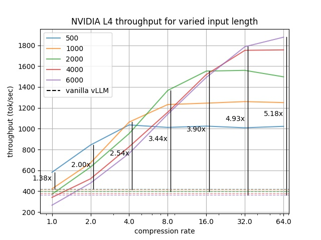

<div style="display: flex; margin-right: -200px;align-items: center;">
  <picture>
    <source media="(prefers-color-scheme: dark)" srcset="KV-Compress.svg">
    
  </picture>

</div>

<h3 align="center">
KV cache compression for high-throughput LLM inference
</h3>
<p align="center">
<a href="https://arxiv.org/abs/2410.00161">Paper</a> |
<a href="https://blog.cloudflare.com/workers-ai/making-workers-ai-faster/">Blog</a> |
<a href="https://x.com/isaacrehg">X/Twitter</a>
</p>

---

This is a (messy) fork of [vLLM](https://github.com/vllm-project/vllm) v0.6.0 showcasing our new KV cache compression method that increases throughput for memory-constrained LLM deployments.



## Current Limitations
We will be expanding the set of supported vLLM features as we upstream this work. The following features are not *yet* supported:
- Tensor Parallelism
- Chunked-prefill
- Prefix caching
- FlashInfer and other non-FlashAttention attention backends
- CUDA graphs

## Setup

It is recommended to run within the NVIDIA PyTorch image:

```
docker run --gpus all -it --rm --ipc=host nvcr.io/nvidia/pytorch:24.04-py3
```

Install from source:
```
cd vllm-kvcompress/
pip install -e .
```

Alternatively, the prebuilt wheel can be used for x86 architectures:

```
pip install https://pub-ff08b7559526447fb14dd52ec4fac7c7.r2.dev/17da8eb/build/sm_89/vllm-0.6.0%2Bcu124-cp310-cp310-linux_x86_64.whl
```

## Inference

The inference server can be launched with:
```
export model=meta-llama/Meta-Llama-3.1-8B-Instruct
vllm serve $model --enforce-eager --enable-kvc
```

Requests can then be sent with
```
curl http://localhost:8000/v1/completions \
  -H "Content-Type: application/json" \
  -d '{
    "model": "meta-llama/Meta-Llama-3.1-8B-Instruct",
    "prompt": "San Francisco is a",
    "max_tokens": 7,
    "temperature": 0,
    "max_cache_tokens": 128,
    "protected_window_size": 32,
    "compress_once": false
  }'
```

Compression can be configured per-request by setting the following additional sampling parameters:

 - **max_cache_tokens** - Configure the max number of KVs to retain in cache for this sequence, computed as `num_layers * num_kv_heads * max_cache_tokens`
 - **protected_window_size** - The window of final tokens for this sequence whose KVs will be protected during compression.
 - **compress_once** - If set, the sequence will only be compressed during the first compression iteration after its prefill.


## Running Experiments

### LongBench
```
cd vllm-kvcompress/experiments/
```

To run experiments with a limited observation window (*KVC-w*):
```
export dataset=narrativeqa model=llama3 w=8 cache_size=128
python run_longbench.py \
  --dataset $dataset \
  --model $model \
  --protected-window-size $w \
  --prefill-metric-collection-window-size $w \
  --max-cache-tokens $cache_size
```

To run experiments with full query-range aggregation (*KVC-full*):
```
python run_longbench.py \
  --dataset $dataset \
  --model $model \
  --protected-window-size 32 \
  --metric-collection-buffer-size 10 \
  --prefill-metric-collection-window-size 33000 \
  --prefill-metric-collection-block-size 1024 \
  --no-maxpool-metrics \
  --gpu-mem-util 0.6 \
  --max-cache-tokens $cache_size
```
**Note:** Aggregating over the full query-range requires significant memory and should be run on an H100 or comparable GPU to avoid OOMs. Lowering `gpu-mem-util` will save more GPU memory for the aggregation and lowering `prefill-metric-collection-block-size` will lower the required memory for the aggregation, at the expense of longer execution time.

Experiments can be run with continual compression (compressing during decoding as well as on prefill) by adding the `--continual-compression` flag. To reproduce results in the paper, `--compression-rate` can be used to limit cache size instead of `--max-cache-tokens`:

```
export cr=64
python run_longbench.py \
  --dataset $dataset \
  --model $model \
  --protected-window-size $w \
  --prefill-metric-collection-window-size $w \
  --continual-compression \
  --compression-rate $cr
```

Run scripts used for our experiments can be found in `experiments/scripts`.

### Benchmark Throughput

```
cd vllm-kvcompress/
```
Run vLLM's benchmarking script with:
```
export model=meta-llama/Meta-Llama-3.1-8B-Instruct \
  max_model_len=19000 input_len=6000 cr=64
python3 benchmarks/benchmark_throughput.py \
  --model $model \
  --max-model-len $max_model_len \
  --enforce-eager \
  --num-prompts 256 \
  --input-len $input_len \
  --output-len 500 \
  --protected-window-size 32 \
  --compression-rate $cr \
  --enable-kvc
```

Run scripts used for our experiments can be found in `benchmarks/scripts`.

## Citation

If you use this work in research/projects of your own, please cite our [paper](https://arxiv.org/abs/2410.00161):
```bibtex
@misc{rehg2024kvcompresspagedkvcachecompression,
      title={KV-Compress: Paged KV-Cache Compression with Variable Compression Rates per Attention Head},
      author={Isaac Rehg},
      year={2024},
      eprint={2410.00161},
      archivePrefix={arXiv},
      primaryClass={cs.CL},
      url={https://arxiv.org/abs/2410.00161},
}
```
